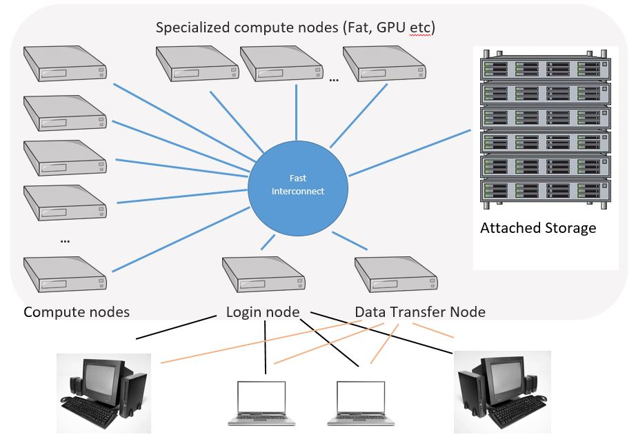
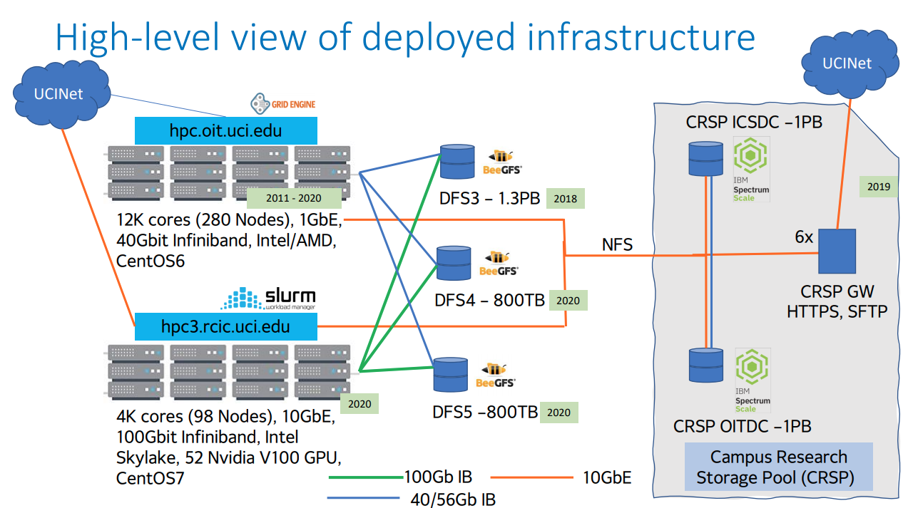

# Computational Lab Skills for Cognitive Science
% Joachim Vandekerckhove

---

## High performance computing

---

---

---

### Unix

---

### Shell commands

* ls
* touch, rm
* mkdir, cd, rmdir
* cp, mv
* alias
* ln
* history
* man, whatis

---

### Shell commands: Accessing remote computers

* wget
* ssh
* scp
* sshfs
* screen

---

### Basic scripting

* cat, more, less
* head, tail
* nano
* hashbang #!
* dotslash ./
* Bash variables, $0, $1 ...
* grep, sed
* \|, >, \>\>, <, <<, &&, and \\

---

### Permissions and keys

* rwxrwxrwxd, dotfiles
* sudo
* public key _id_rsa.pub_ (=lock)
* private key _id_rsa_ (=key)

[Linux-fu](https://linuxjourney.com/)

---

## Version control

* Allow tracking of changes
* Allow branching and merging
* Highly secure

---

---

### git

* Lots of functionality
* High performace
* Industry standard
* Not too hard to get started
* Quite hard to master

---

### git commands

* git status
* git pull
* git push
* git add
* git commit
* git clone
* git checkout
* git diff
* git fetch
* git merge

---

### git habits

* commit often
* always pull latest versions
* use branches
* comment on commits a lot
* test changes before committing

---

### git first time

1. Create an ssh key pair and copy the public key to your github.com account
1. Make a new repo on github.com
1. Give git your identity locally

<!-- end list -->

    git config --global user.email
        "joachim.vandekerckhove@gmail.com"
    git config --global user.name "joachim-student"
    git config --global --list

4. Clone the repo locally

<!-- end list -->

    git clone git@github.com:joachim-student/cogs-205b.git

---

### Example workflow

5. Create a new branch

<!-- end list -->

    git -C cogs-205b/ checkout -b small-edits
  
6. Make changes, commit frequently

<!-- end list -->

      ... (make new file)
    git add my.new.file.name
    git commit -m "New file added!"
      ... (make small edit)
    git commit -a -m "I made a small change"
      ... (make tiny edit)
    git commit -a -m "I made a tiny change"

7. Push

<!-- end list -->

    git push --set-upstream origin main
    git push

---

### Different example workflow

1. `git checkout main`
1. `git fetch --all --prune`
1. `git rebase`
1. `git -C repo/ checkout -b bugfix`
1. _(make small edit)_
1. `git -C repo/ commit -a -m "Fixed bug"`
1. `git push`
1. _(open pull request)_

[Git tutorial](https://www.atlassian.com/git/tutorials/)

[Git cheat sheet](https://www.atlassian.com/dam/jcr:e7e22f25-bba2-4ef1-a197-53f46b6df4a5/SWTM-2088_Atlassian-Git-Cheatsheet.pdf)

---

### Learning goals

You will need to use these technologies to do and submit the assignments

---

### Assignment

Write and run a shell script: update-version.sh

The script should do these things:

1. Ensure that the local repository is up to date with the one on github.com
1. Saves the current date and time in a file called `version`
1. Updates your github repository with the new file

