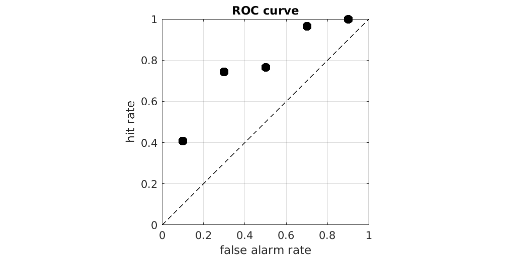
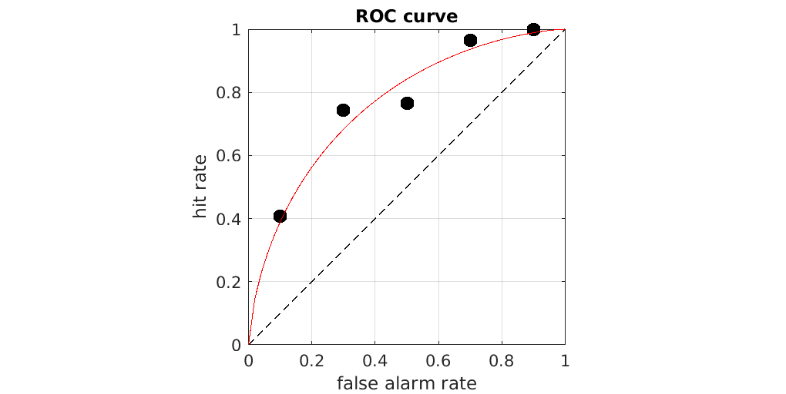

## Assignment 4: Simulate and recover

In this assignment, you will again extend the `SignalDetection` class to include several new methods.

### `simulate()`

A <u>static factory method</u> to create one or more `SignalDetection` objects with simulated data.  The method should accept one drift rate, $K$ criteria, one signal count, and one noise count.  It should return $K$ `SignalDetection` objects.  $K \geq 1$.

The method should have this signature: `sdtList = SignalDetection.simulate(dprime, criteriaList, signalCount, noiseCount)`.   `sdtList` should be an array of `SignalDetection` objects, `criteriaList` an array of criteria, and the rest scalars.

### `plot_roc()`

A <u>static method</u> that takes multiple `SignalDetection` objects and plots the Receiver Operating Characteristic (ROC) curve.  The result should look something like this, with each marker referring to the hit rate and false alarm rate in one condition:



The method should have this signature: `SignalDetection.plot_roc(sdtList)`.   `sdtList` should be an array of `SignalDetection` objects.

### `nLogLikelihood()`

An <u>instance method</u> that calculates the negative log-likelihood of a `SignalDetection` object given an arbitrary hit rate and false alarm rate.  The method should take a hit rate $\theta$ and false alarm rate $\gamma$ as input and calculate the likelihood on the basis of the object's own hits $h$, false alarms $f$, misses $m$ , and correct rejections $r$.  The likelihood function $L$ is the product of two binomial likelihoods, from which we can remove some constants, and so the negative log-likelihood $\ell$ is:
```math
\begin{aligned}
P\left(h,f|\theta,\gamma,m,r\right)
  &= {h+m \choose h} \theta^h\left(1-\theta\right)^m \times {f+r \choose f}\gamma^f\left(1-\gamma\right)^r\\
  &\propto \theta^h\left(1-\theta\right)^m \gamma^f\left(1-\gamma\right)^r\\
\Rightarrow\ell\left(\theta,\gamma;h,f,m,r\right) &= -h\log\theta - m\log\left(1-\theta\right) - f \log\gamma - r\log\left(1-\gamma\right)
\end{aligned}
```
The method should have this signature: `ell = sdt.nLogLikelihood(hitRate, falseAlarmRate)`.   `ell`, `hitRate`, and `falseAlarmRate` should be scalars.

### `rocCurve()`

A <u>static method</u> that computes this one-parameter ROC curve function:
```math
\bar\theta_i = \Phi\!\left(a + \Phi^{-1}\!\left(\gamma_i\right)\right)
```
Here, $\Phi$ is the CDF of a standard normal distribution and $\Phi^{-1}$ is its inverse.  

The method should have this signature: `hitRate = rocCurve(falseAlarmRate, a)`. `hitRate` and `falseAlarmRate` should be vectors of equal size and `a` should be a scalar. 

### `fit_roc()`

A <u>static method</u> that fits this one-parameter function to observed [hit rate, false alarm rate] pairs.  Note that the ROC curve should have $K$ markers, each coming from their own `SignalDetection` object with hit rate $\theta_i$ and false alarm rate $\gamma_i$.

"Fitting the function" means finding the specific value for the parameter $a$ that minimizes the loss function: 
```math
L(a) = \sum_i \ell\left(
\Phi\!\left[a + \Phi^{-1}\!\left(\gamma_i\right)\right],\gamma_i; h_i,f_i,m_i,r_i
\right)
```

That is, the estimated value is $\hat{a} = \arg\min_aL(a)$.  Your choice of optimization algorithm shouldn't matter too much.  Then draw the fitted curve with parameter $\hat{a}$ to the ROC plot, so that it looks like this:



If you've done every step correctly, then $\hat{a} \approx d'$.

The method should have this signature: `SignalDetection.fit_roc(sdtList)`.   `sdtList` should be an array of `SignalDetection` objects.

### `rocLoss()`

A <u>static method</u> that evaluates the loss function $L(a)$:
```math
L(a) = \sum_i \ell\left(
\Phi\!\left[a + \Phi^{-1}\!\left(\gamma_i\right)\right],\gamma_i; h_i,f_i,m_i,r_i
\right)
```
Note that the summation in the equation is over `SignalDetection` objects, taking the _observed_ false alarm rate $\gamma_i$ from each and using that to compute the _predicted_ hit rate $\bar\theta_i = \Phi\left(a + \Phi^{-1}\left(\gamma_i\right)\right)$ for each.  Then the method will call the `nLogLikelihood()` method of each `SignalDetection` object and add all the $\ell$ values together.

The method should have this signature: `L = SignalDetection.rocLoss(sdtList, a)`.   `sdtList` should be an array of `SignalDetection` objects, and `a` should be a scalar.


---

Useful functions to complete the assignment:

* Python
  1.  `numpy.random.binomial()` function to simulate the hits, misses, false alarms, and correct rejections for each set of parameters.
  2.  `scipy.optimize.minimize()` for minimizing.
  3.  The test suite in [py/TestSignalDetection.py](py/TestSignalDetection.py)
* MATLAB
  1. `binornd()` function to simulate the hits, misses, false alarms, and correct rejections for each set of parameters.
  2. `fminsearch()` for minimizing.
  3. The test suite in [m/TestSignalDetection.m](m/TestSignalDetection.m)

The names of the unit tests will tell you something about why they fail.  For the other functions, you may need to access their documentation.

Your code should pass the test suite, generate no errors when used correctly, and should be generally free of code smells such as repetition of code or obscure naming of variables.
